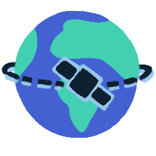
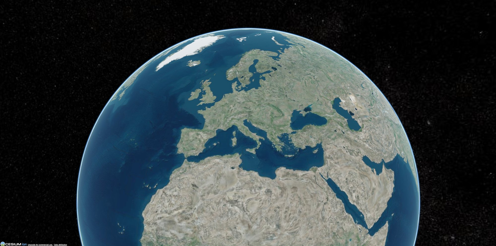
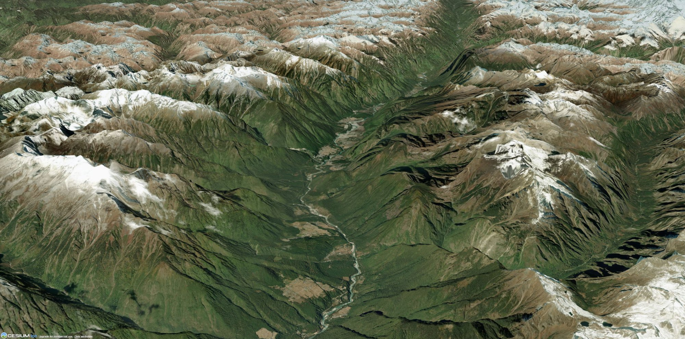
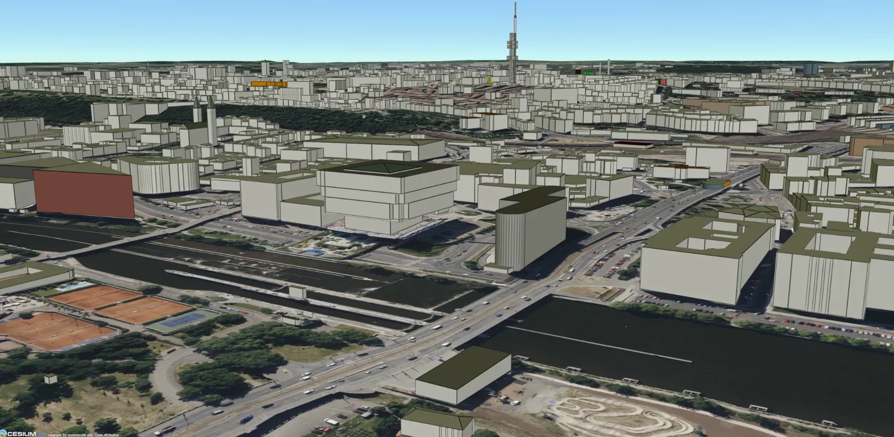
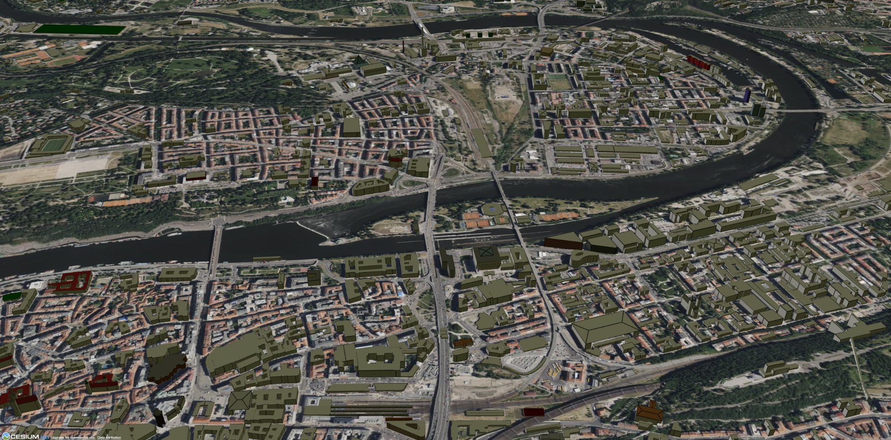

<div align="center">
  
</div>

# Cesium Satellite Tracker

A React + CesiumJS application for real-time satellite tracking, orbital visualization, and geospatial analysis. Built to explore satellite operations, orbital mechanics, and 3D Earth visualization techniques relevant to aerospace and defense applications.

## Screenshots

<div align="center">
  
  <p><em>3D Earth visualization with Cesium World Terrain</em></p>
</div>

<div align="center">
  
  <p><em>High-resolution terrain rendering with elevation data</em></p>
</div>

<div align="center">
  
  <p><em>OSM 3D Buildings layer - Prague city center</em></p>
</div>

<div align="center">
  
  <p><em>Detailed urban visualization with photorealistic imagery</em></p>
</div>

## Project Goals

This project serves as a technical foundation for understanding:
- Real-time satellite position propagation using Two-Line Element (TLE) sets
- 3D visualization of Low Earth Orbit (LEO), Medium Earth Orbit (MEO), and Geostationary (GEO) satellites
- Ground track computation and coverage analysis
- Integration of geospatial data with orbital mechanics
- Performance optimization for tracking large satellite constellations

## Current Implementation

**Core Infrastructure:**
- React 18 + TypeScript + Vite development environment
- CesiumJS 3D globe with Cesium World Terrain
- OSM 3D Buildings layer for urban visualization
- Minimal UI (Cesium default widgets disabled for custom controls)
- Modular Cesium service layer (viewer creation, camera control, layer management)

**Camera & Visualization:**
- Initial view positioned over Prague (testing ground for 3D building visibility)
- Terrain-aware rendering with elevation data
- Configurable camera orientations (heading, pitch, roll)

## Development Roadmap

### Phase 1: Core Satellite Tracking
- [ ] **TLE Data Integration**: Research and implement satellite orbital data source (TLE format)
- [ ] **Orbital Propagation**: Implement SGP4/SDP4 algorithm for position/velocity computation
- [ ] **Single Satellite Visualization**: Render satellite entity with animated real-time position
- [ ] **Orbit Path Rendering**: Display ground track (past trail) and predicted future orbit
- [ ] **Time Control System**: Simulation time manipulation (real-time, acceleration, reverse)
- [ ] **Performance Foundation**: Establish update throttling and rendering optimization patterns

### Phase 2: Multi-Satellite Support & Optimization
- [ ] **Constellation Architecture**: Support for tracking multiple satellites simultaneously
- [ ] **Efficient Data Management**: Implement caching strategies for orbital data
- [ ] **Level-of-Detail (LOD)**: Optimize rendering based on camera distance and visible satellites
- [ ] **Update Throttling**: Smart position update scheduling to maintain frame rate
- [ ] **Memory Management**: Proper cleanup and resource disposal for large datasets
- [ ] **Grouping & Filtering**: Organize satellites by type, constellation, or custom categories
- [ ] **Search & Selection**: Fast lookup and selection mechanisms

### Phase 3: Analysis & Coverage Tools
- [ ] **Ground Station Integration**: Add observer positions with visibility calculations
- [ ] **Coverage Visualization**: Satellite footprint and visibility zone rendering
- [ ] **Pass Prediction**: Calculate visibility windows for ground locations
- [ ] **Proximity Detection**: Basic conjunction analysis for close approaches
- [ ] **Performance Profiling**: Identify and resolve bottlenecks in large-scale scenarios

### Phase 4: Geospatial Integration
- [ ] **Custom Overlays**: Point, line, and polygon annotations on globe
- [ ] **GeoJSON Support**: Import/export standard geospatial data formats
- [ ] **Measurement Tools**: Distance, area, and elevation calculations
- [ ] **Layer Management**: Efficient handling of multiple data layers

### Phase 5: User Experience & Polish
- [ ] **Interface Design**: Clean, functional UI for controls and data display
- [ ] **Camera Controls**: Smart navigation and tracking features
- [ ] **Responsive Design**: Cross-device compatibility
- [ ] **Error Handling**: Graceful degradation and user feedback
- [ ] **Documentation**: Usage guides and code documentation

## Technical Stack

**Frontend:**
- React 19.2 (functional components, hooks)
- TypeScript 5.9 (strict type checking)
- Vite 7.3 (fast HMR, optimized builds)

**3D Visualization:**
- CesiumJS 1.138 (WebGL-based 3D globe)
- Cesium Ion (terrain, imagery streaming)

**Orbital Mechanics (Planned):**
- SGP4/SDP4 propagation algorithms
- TLE (Two-Line Element) data format
- Research: Data source selection (public APIs, local datasets)
- Research: Real-time vs. cached prediction strategies

**Future Considerations:**
- IndexedDB for offline data persistence
- Web Workers for computation-heavy orbital calculations
- WebAssembly for performance-critical propagation code
- GeoJSON standard for interoperability

## Use Cases

**Educational:**
- Learn orbital mechanics and satellite operations
- Visualize how different orbit types behave (LEO vs GEO)
- Understand ground track patterns and coverage

**Operational Planning:**
- Track International Space Station (ISS) passes
- Monitor satellite constellation deployments
- Plan ground station visibility windows

**Situational Awareness:**
- Visualize satellite positions relative to ground infrastructure
- Identify potential conflicts in orbital space
- Analyze coverage gaps in communication networks

## Setup & Development

### Prerequisites
- Node.js 18+ and npm
- Cesium Ion access token (free tier available at [cesium.com/ion](https://cesium.com/ion))

### Installation
```bash
# Clone the repository
git clone <repository-url>
cd cesium-satellite-tracker

# Install dependencies (automatically copies Cesium assets)
npm install

# Create .env file with your Cesium Ion token
echo "VITE_CESIUM_TOKEN=your_token_here" > .env
```

**Note:** The `postinstall` script automatically copies Cesium assets from `node_modules` to `public/cesium/` after installation. The `public/cesium/` directory is auto-generated and should not be committed to git.

### Development
```bash
# Start development server
npm run dev

# Build for production
npm run build

# Preview production build
npm run preview
```

### Project Structure
```
src/
├── components/
│   └── Globe.tsx           # Main Cesium viewer component
├── cesium/
│   ├── createViewer.ts     # Viewer initialization
│   ├── setDefaultView.ts   # Camera configuration
│   └── addOsmBuildings.ts  # 3D buildings layer
├── App.tsx                 # Root component
├── main.tsx               # Application entry point
└── index.css              # Global styles
```

## Learning Resources

**CesiumJS:**
- [CesiumJS Tutorials](https://cesium.com/learn/cesiumjs-learn/)
- [API Reference](https://cesium.com/learn/cesiumjs/ref-doc/)
- [Sandcastle Examples](https://sandcastle.cesium.com/)

**Orbital Mechanics:**
- [Two-Line Element Format](https://en.wikipedia.org/wiki/Two-line_element_set)
- [SGP4 Algorithm](https://en.wikipedia.org/wiki/Simplified_perturbations_models)
- [satellite.js](https://github.com/shashwatak/satellite-js) - JavaScript implementation

**Data Sources:**
- [Celestrak](https://celestrak.org/) - Satellite TLE data
- [Space-Track.org](https://www.space-track.org/) - Official catalog

## Development Notes

This project is being developed as a hands-on exploration of satellite tracking technology and geospatial visualization. It demonstrates:
- Practical application of orbital mechanics principles
- Integration of real-time data with 3D visualization
- Modern React development patterns with TypeScript
- Performance considerations for real-time applications

The roadmap focuses on features relevant to operational satellite tracking systems, with emphasis on multi-satellite support, coverage analysis, and situational awareness tools commonly used in aerospace and defense contexts.

## License

This project is for educational and portfolio purposes.

## Acknowledgments

- **CesiumJS** for providing an excellent 3D geospatial platform
- **Cesium Ion** for terrain and imagery data
- **OpenStreetMap** contributors for building data
- **CelesTrak** for satellite TLE data
- Icon design by Alena Klimecká

---

**Status:** Active Development | **Last Updated:** February 2026