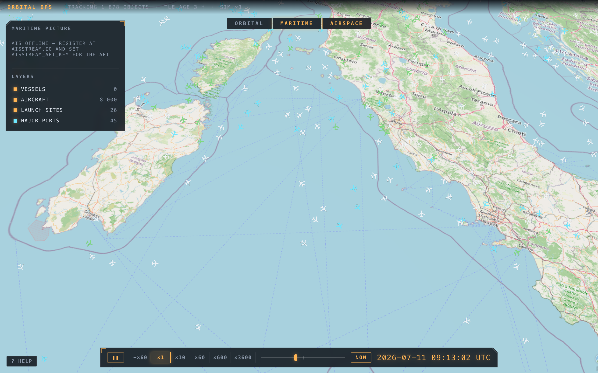

<div align="center">
  
  <h1>ORBITAL OPS</h1>
  <p><em>Real-time satellite tracking and 3D Earth visualization</em></p>

  <p>
    
    
    
    
    
  </p>
</div>

A real-time, multi-domain ops console on a CesiumJS globe: 12,000+ satellites propagated with SGP4 in a Web Worker, plus live aircraft (ADS-B) and ships (AIS), with launch-site and port overlays. Satellites run on a warpable simulation clock with polar-sky-plot pass predictions; aircraft and ships stay wall-clock live. Token-free, and it boots offline from a committed TLE seed.

## Screenshots

<div align="center">
  
  <p><em>ORBITAL mode — full catalog: 12,408 objects including the Starlink shell, day/night terminator, orbit-class colors</em></p>
</div>

<div align="center">
  
  <p><em>ORBITAL mode — tracking ISS (ZARYA): live telemetry, orbit path, ground track, visibility footprint, and 24 h pass predictions with a polar sky plot</em></p>
</div>

<div align="center">
  
  <p><em>AIRSPACE mode — camera follow-locked onto a live Ryanair flight over the Tyrrhenian Sea; aircraft icons rotate with their track and are colored by altitude band</em></p>
</div>

## Features

- **Three OPS modes** — MFD-style tabs (`1`/`2`/`3`) switch the HUD between **ORBITAL**, **MARITIME**, and **AIRSPACE**. Clicking any object on the globe jumps to its domain.
- **Satellite catalog & propagation** — 12 curated CelesTrak groups (stations, Starlink, OneWeb, GNSS constellations, GEO belt, science, …) served by a small caching API; a Web Worker runs batch SGP4 (satellite.js) and the globe renders a single `PointPrimitiveCollection` colored by orbit class (LEO/MEO/GEO/HEO). Search by name or NORAD id.
- **Selected-satellite tracking** — smooth per-frame motion, orbit path, antimeridian-safe ground track, visibility footprint, and a live telemetry panel.
- **Pass prediction + sky plot** — AOS/LOS windows over the next 24 h for a configurable observer (edit coordinates or use GPS), drawn on a polar az/el sky plot; one click jumps sim time to the pass.
- **Live aircraft (ADS-B)** — OpenSky polling (anonymous out of the box; `OPENSKY_CLIENT_ID`/`OPENSKY_CLIENT_SECRET` speed it up), colored by altitude band, dead-reckoned between polls.
- **Live ships (AIS)** — aisstream.io ingest (free `AISSTREAM_API_KEY` in `apps/api/.env`; without it the panel shows AIS OFFLINE), colored by type, dead-reckoned along their course.
- **Overlays & layer toggles** — launch sites and major ports as toggleable markers; a LAYERS panel toggles vessels, aircraft, launch sites, and ports independently in any mode.
- **Camera follow-lock + keyboard** — selecting a ship/aircraft auto-locks the camera; `F` rides a satellite, `ESC` releases then deselects. WASD/arrows orbit, `Q`/`E` zoom, `SPACE` play/pause, `,`/`.` warp, `N` now. Press **H** or **?** in-app for the full cheat sheet.
- **Simulation time** — one sim clock drives satellites and the day/night terminator: play/pause, warp ×1–×3600, rewind, ±12 h scrub, NOW reset. Ships and aircraft stay wall-clock live and never time-travel with it.
- **Token-free Cesium** — falls back to OpenStreetMap imagery + ellipsoid terrain; set `VITE_CESIUM_TOKEN` for Cesium World Terrain.
- **Runs offline** — a committed TLE seed boots the API without network; live data refreshes stale-while-revalidate (6 h TTL, per-group failure cooldown).

## Architecture

npm-workspaces monorepo: `apps/web` (Vite + React 19 + CesiumJS), `apps/api`
(Hono + `node:sqlite` TLE cache + live feeds on `:8787`), and `packages/shared`
(zod contracts). Data flows CelesTrak → API cache → `/api/*` → worker SGP4 →
Cesium point primitives. See [docs/ARCHITECTURE.md](docs/ARCHITECTURE.md) for the
vertical-slice layout and dependency rules, and [docs/API.md](docs/API.md) for the
endpoint reference.

## Quickstart

```bash
git clone <repository-url>
cd cesium-satellite-tracker
npm install          # also copies Cesium static assets
npm run dev          # api on :8787 + web on :5173 (open http://localhost:5173)
```

- **Development** (workspace layout, tests, seed regeneration, env files): [docs/DEVELOPMENT.md](docs/DEVELOPMENT.md)
- **Usage** (modes, controls, follow-lock, passes, sim time): [docs/CONTROLS.md](docs/CONTROLS.md)
- **Production deploy** (Docker Compose, reverse proxy, CI/CD): [docs/DEPLOY.md](docs/DEPLOY.md)

## Data sources & credits

- [CelesTrak](https://celestrak.org/) — satellite TLE data (please fetch politely; the caching API exists for exactly this).
- [OpenSky Network](https://opensky-network.org/) — live aircraft ADS-B state vectors.
- [aisstream.io](https://aisstream.io/) — live ship AIS position reports.
- [OpenStreetMap](https://www.openstreetmap.org/) contributors — token-free imagery tiles.

## License

Released under the [MIT License](LICENSE). Built for educational and portfolio purposes.

## Acknowledgments

- **CesiumJS** for providing an excellent 3D geospatial platform
- **Cesium Ion** for terrain and imagery data
- **OpenStreetMap** contributors for imagery tiles
- **CelesTrak** for satellite TLE data
- **satellite.js** for the SGP4 implementation
- Icon design by Alena Klimecká

---

**Status:** Active Development | **Last Updated:** July 2026
