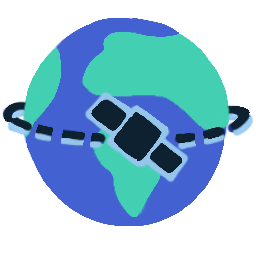
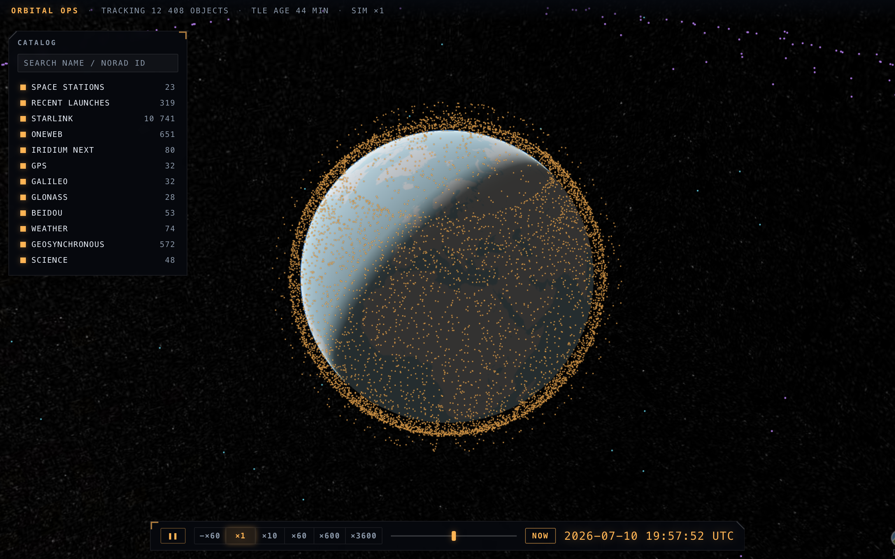
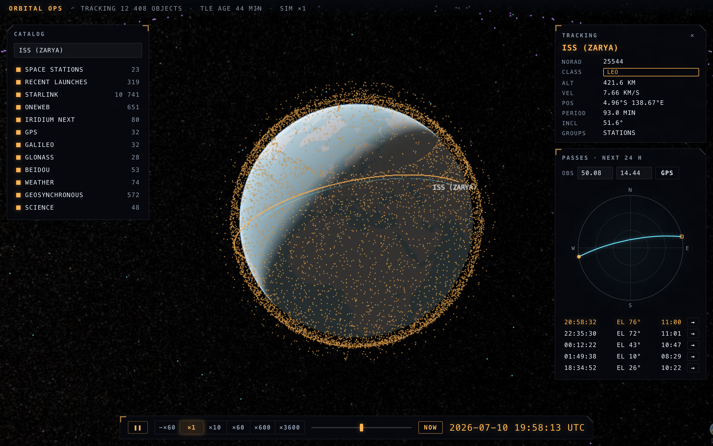

<div align="center">
  
  <h1>ORBITAL OPS</h1>
  <p><em>Real-time satellite tracking and 3D Earth visualization</em></p>

  <p>
    
    
    
    
    
  </p>
</div>

A working real-time satellite tracker: 12,000+ objects propagated with SGP4 in a Web Worker and rendered as GPU point primitives on a CesiumJS globe, fed by a caching TLE backend with a committed offline seed. Time is simulated — play, warp up to ×3600, rewind, scrub — and pass predictions come with a polar sky plot.

## Screenshots

<div align="center">
  
  <p><em>Full catalog: 12,408 objects including the Starlink shell, day/night terminator, orbit-class colors</em></p>
</div>

<div align="center">
  
  <p><em>Tracking ISS (ZARYA): live telemetry, orbit path, ground track, visibility footprint, and 24 h pass predictions with a polar sky plot</em></p>
</div>

## Features

- **Live TLE catalog** — 12 curated CelesTrak groups (stations, Starlink, OneWeb, GNSS constellations, GEO belt, science, …) served by a small caching API; searchable by name or NORAD id.
- **Whole-constellation propagation** — a Web Worker runs batch SGP4 (satellite.js) and streams ECEF positions as transferable `Float32Array`s; the globe renders them as a single `PointPrimitiveCollection` colored by orbit class (LEO / MEO / GEO / HEO).
- **Selected-satellite tracking** — per-frame propagation on the main thread for smooth motion, orbit path, antimeridian-safe ground track, visibility footprint, and a live telemetry panel (altitude, velocity, position, period, inclination).
- **Simulation time** — one sim clock drives everything: play/pause, warp ×1 – ×3600, rewind, ±12 h scrub, and a NOW reset. The Cesium sun/terminator follows sim time.
- **Pass prediction** — AOS/LOS windows (bisection-refined to ~1 s) for a configurable observer over the next 24 h, drawn on a polar az/el sky plot; one click jumps sim time to the pass.
- **Runs without a Cesium Ion token** — falls back to OpenStreetMap imagery + ellipsoid terrain; with `VITE_CESIUM_TOKEN` set you get Cesium World Terrain.
- **Runs without network** — a committed TLE seed (12,653 records) boots the API offline; live data refreshes stale-while-revalidate with a 6 h TTL and per-group failure cooldown.
- **Multi-domain ops modes** — MFD-style tabs switch the HUD between ORBITAL, MARITIME, and AIRSPACE. Clicking any object on the globe jumps to its domain.
- **Live aircraft (ADS-B)** — OpenSky `/states/all` polling (anonymous works out of the box; a free OpenSky account via `OPENSKY_CLIENT_ID`/`OPENSKY_CLIENT_SECRET` speeds polling to 60 s), ~10k aircraft colored by altitude band, dead-reckoned between polls.
- **Live ships (AIS)** — aisstream.io WebSocket ingest (free key via `AISSTREAM_API_KEY` in `apps/api/.env`, see `.env.example`); vessels colored by type, dead-reckoned along their course. Without a key the panel shows AIS OFFLINE.
- **Infra overlays** — 26 launch sites and 45 major ports as toggleable markers with zoom-in labels.

## Architecture

npm-workspaces monorepo:

```
apps/
├── api/                  # Hono + node:sqlite TLE cache on :8787
│   ├── src/
│   │   ├── app.ts        # endpoints (injectable db + fetcher → testable)
│   │   ├── celestrak.ts  # GP fetcher + 3-line TLE parser (Alpha-5 aware)
│   │   ├── db.ts         # sqlite schema & queries (zero native deps)
│   │   ├── refresh.ts    # stale-while-revalidate, TTL, failure cooldown
│   │   └── seed.ts       # loads the committed snapshot on first boot
│   └── seed/*.tle        # offline TLE snapshot
└── web/                  # Vite + React 19 + CesiumJS
    └── src/
        ├── core/
        │   ├── engine/   # non-React Cesium wrapper (token-free fallback)
        │   └── sim/      # simulation clock (Zustand) — the time authority
        ├── workers/      # propagation.worker.ts — batch SGP4 → Float32Array
        ├── features/     # catalog, constellation, tracking, passes, timebar
        └── lib/          # orbital math, API client, formatters
packages/
└── shared/               # zod schemas — the API contract
```

**Data flow:** CelesTrak → API cache (SQLite, 6 h TTL, seed fallback) → `/api/*` → catalog store → worker SGP4 → ECEF positions → point primitives. The selected satellite is propagated on the main thread every frame; the rest of the constellation ticks at 1–4 Hz.

**API:** `GET /api/health` · `/api/groups` · `/api/satellites?group=` · `/api/satellites/search?q=` · `/api/satellites/:noradId`

## Setup & Development

### Prerequisites
- Node.js **≥ 22.5** (`node:sqlite` is built in — no native dependencies)
- No Cesium token required (optional: free Ion token for world terrain)

### Run it
```bash
git clone <repository-url>
cd cesium-satellite-tracker
npm install          # also copies Cesium static assets

npm run dev          # api on :8787 + web on :5173, proxied together
```

Optional Ion terrain:
```bash
echo "VITE_CESIUM_TOKEN=your_token_here" > apps/web/.env
```

### Other commands
```bash
npm run build              # typecheck + build all workspaces
npm test                   # 52 tests: API endpoints, orbital math, stores, schemas
npm run lint               # eslint across the monorepo
npm run seed:make -w apps/api   # refresh the committed TLE snapshot from CelesTrak
```

## Testing

- **`apps/api`** — endpoint tests against an in-memory SQLite DB with an injected fake fetcher and clock: TTL behavior, stale-while-revalidate, offline 503s, failure cooldown, search escaping, Alpha-5 NORAD ids.
- **`apps/web`** — orbital math pinned to a real ISS TLE (period, altitude, velocity, ground-track bounds, Prague pass windows), sim-clock semantics, formatters.
- **`packages/shared`** — schema round-trips.

## Learning Resources

- [CesiumJS Tutorials](https://cesium.com/learn/cesiumjs-learn/) · [Sandcastle Examples](https://sandcastle.cesium.com/)
- [Two-Line Element Format](https://en.wikipedia.org/wiki/Two-line_element_set) · [SGP4 Algorithm](https://en.wikipedia.org/wiki/Simplified_perturbations_models)
- [satellite.js](https://github.com/shashwatak/satellite-js) — the propagation library used here
- [CelesTrak](https://celestrak.org/) — TLE data source (please fetch politely; that's what the caching API is for)

## License

Released under the [MIT License](LICENSE). Built for educational and portfolio purposes.

## Acknowledgments

- **CesiumJS** for providing an excellent 3D geospatial platform
- **Cesium Ion** for terrain and imagery data
- **OpenStreetMap** contributors for imagery tiles
- **CelesTrak** for satellite TLE data
- **satellite.js** for the SGP4 implementation
- Icon design by Alena Klimecká

---

**Status:** Active Development | **Last Updated:** July 2026
